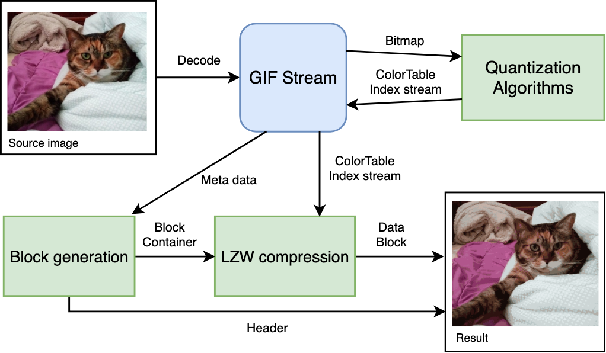

Structed GIF Encoder
====================

The GIF Encoder, which have a source code that easy to read. Totally based on documentation 'spec-gif89a'. Source code is written by Typescript. I planned to implement various quantization algorithms.

Encoding flow
-------------

Purpose
-------
- Easy to read the source code.
- If you are first time to learn it, you can get acknowledge about image encoding.
- To actually use.

Prerequsition
-------------
- Latest version of Node.js.

Notice
------
I am not sure about performance. I will keep improve it.  
If you have any idea, make a issue or contact me.

Results
-------
 - Source image (jpeg)  

 - Uniform  

 - Mediancut (still improving)  

Contact
-------
wkblack11@gmail.com

Reference
---------
GIF89a Specifiation  
https://www.w3.org/Graphics/GIF/spec-gif89a.txt

LZW compression used to encode/decode a GIF file by Bob Montgomery  
http://giflib.sourceforge.net/lzgif.txt

What's In A GIF (Useful information to programming)  
http://giflib.sourceforge.net/whatsinagif/index.html

GIF Wikipedia  
https://en.wikipedia.org/wiki/GIF

Median Cut  
http://collaboration.cmc.ec.gc.ca/science/rpn/biblio/ddj/Website/articles/DDJ/1994/9409/9409e/9409e.htm  